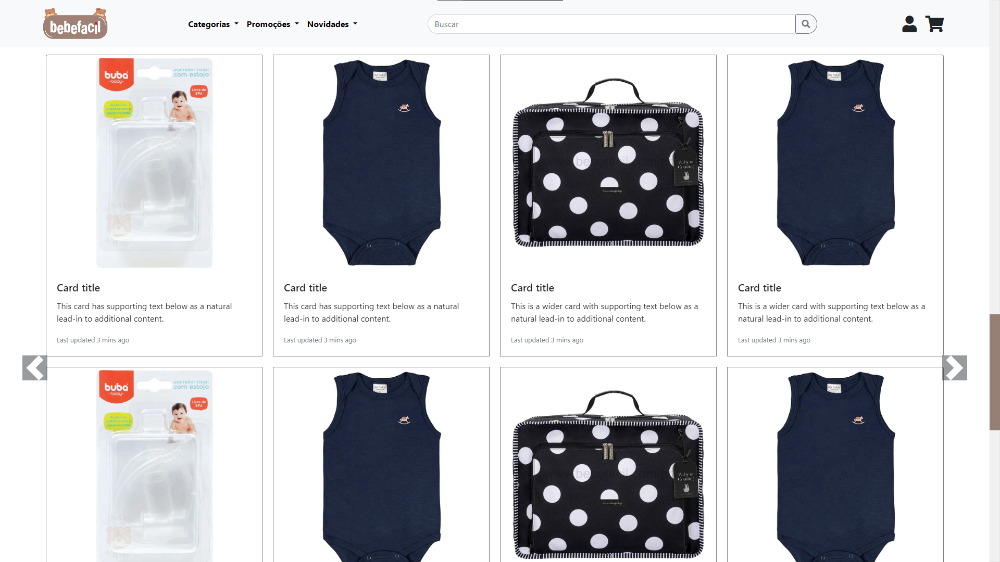

# Bebe-Facil

Projeto para cliente da Alaska Websites

# Recursos

* O aplicativo foi desenvolvido com JavaScrip, CSS, HTML e BootStrap(Página estática).

# Uso

1. Clone o repositório do GitHub.
2. Abra o projeto no seu editor de código.
3. Abra o arquivo index.html(Site institucional).

# Créditos

Este projeto foi criado por Alaska Websites.